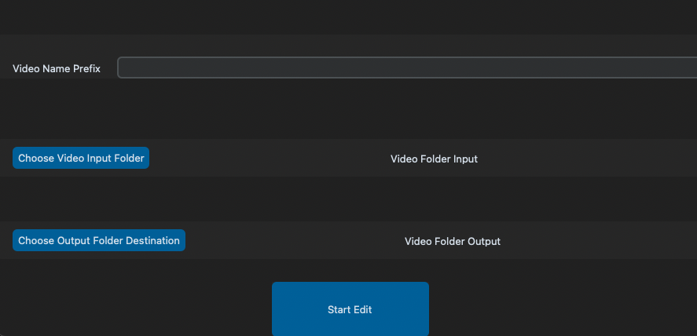

# Batch Media Editor

Software used that was created when building EasyEats, designed to take input folders with edited MP4 videos and output videos to a folder with smaller sizes.

Using OpenCV each video is created by taking a screenshot every 30 frames per second, matching the framerate of the video taken and edited, and combining all the pictures into one video at the end.

MP4 File sizes on average saw a decrease of 67%.

## How It Works

MP4 files were chosen because they are the file type that would work easiest across both native mobile platforms SwiftUI and Kotlin Android Compose. MP4 files are the most compatible for being loaded in and played from the cloud.

Screenshots work because for the videos, some details are allowed to be lost. The main goal is file size > quality, but keeping the quality still high enough to keep shadow, lighting, and smoothness.

By running the screenshots at the same framerate as the original videos, noticeable gains in file size can be noticed while keeping lots of details from the video as well.

Videos keep almost all the original animation quality with little smearing (if any) and lost little image quality, not noticeable enough for being served in small format on mobile.

## Observations

Videos are exported using basic settings attempting to favor file size while keeping more quality still. (Videos could likely be improved further to decrease file size.)

### Video File Size Comparison in Megabytes (mb)

| Intake Files (Edited in Traditional Software) | Output Files (Edited with this Software) |
|-----------------------------------------------|------------------------------------------|
| 40.5                                          | 12.7                                     |
| 27.1                                          | 8.7                                      |
| 24.7                                          | 10.3                                     |
| 23.5                                          | 6.3                                      |
| 21.8                                          | 8.1                                      |
| 16                                            | 5                                        |
| 15.2                                          | 4.9                                      |
| 15.1                                          | 3.6                                      |
| 5.9                                           | 1.5                                      |
| 4.3                                           | 1.5                                      |

This method helps to provide a quick, easy way to speed up video editing. The user only needs to provide an input folder and an output folder, and from there it names the files following a numbered naming convention.
